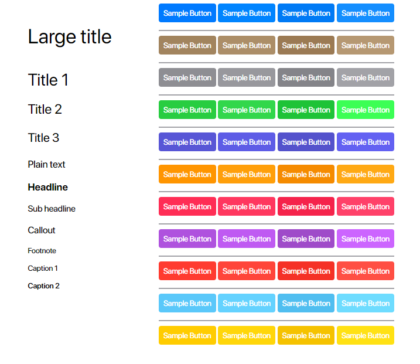

# :art: Simple CSS files with some Apple Visual Guidelines

## :page_with_curl: References

- [Color - Visual Design - macOS](https://developer.apple.com/design/human-interface-guidelines/macos/visual-design/color/)
- [Typography - Visual Design - macOS](https://developer.apple.com/design/human-interface-guidelines/macos/visual-design/typography/)
- [San-Francisco-Pro-Fonts](https://github.com/sahibjotsaggu/San-Francisco-Pro-Fonts)
